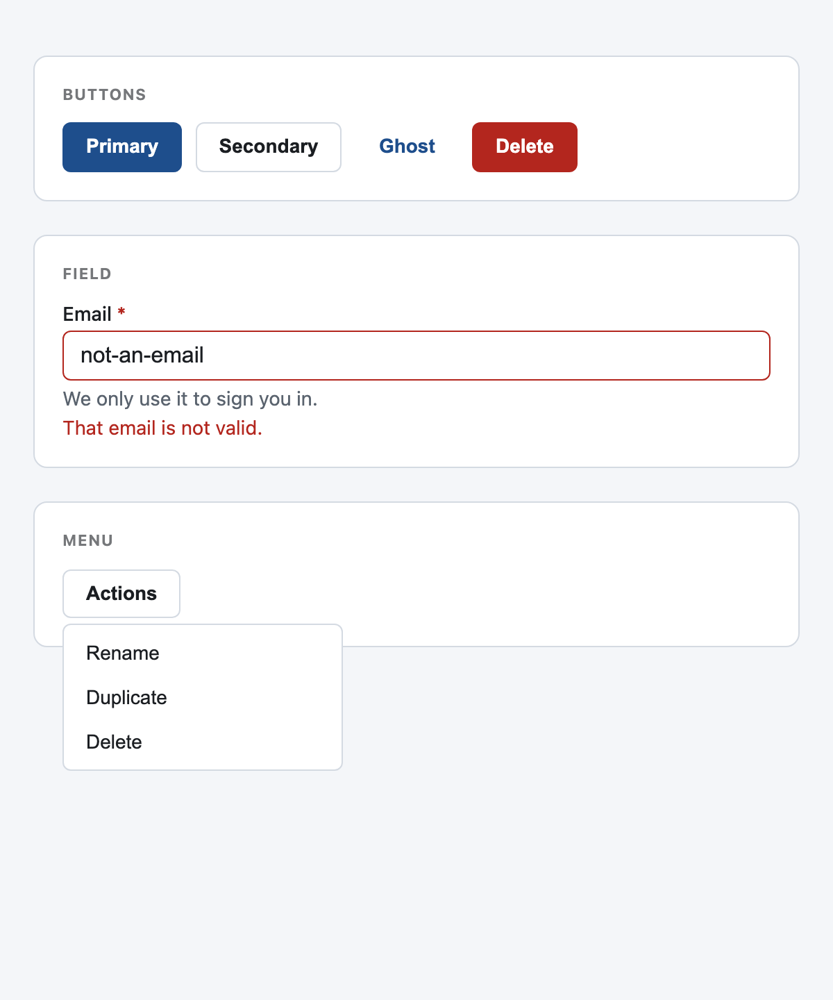

# GRASP

<picture>
  <source media="(prefers-color-scheme: dark)" srcset="assets/grasp-render-dark.png">
  
</picture>

GRASP is operable interaction components: the controls AI builds get wrong. A div is not a button, a modal that opens but never traps focus locks out a keyboard, a field with no wired label is silent to a screen reader, and a dropdown built from divs cannot be reached with the Tab key. GRASP gives you those controls built right, semantic, keyboard-operable, and screen-reader ready by default, themed by TEMPER.

It is **in progress** toward the full set of interaction patterns that need accessibility (the WAI-ARIA Authoring Practices patterns; see the scope note). This is tranche one: **Button, Field, Modal, and Menu**, the four the evidence shows AI breaks most. Tabs, tooltip, accordion, combobox, and the rest follow.

No build step is required. The framework-agnostic core is one small ES module and one CSS file, with a React binding alongside. The package name is `grasp-ui`; it is planned for npm but not yet published.

## Native-first

GRASP builds on the semantic element wherever one exists and hand-rolls behavior only where none does. The button is a real `<button>`; the field wires native inputs; the modal is the native `<dialog>` element, which gives a focus trap, Escape, and focus return for free. A custom widget appears only where the platform has no element for the pattern (the menu).

## The components

- **Button**: `.grasp-button` on a real `<button>` or `<a>`, with variants (primary, secondary, ghost, danger), a disabled and a busy state, and a visible focus ring.
- **Field**: `<grasp-field>` wires the label to the control, the error and hint via `aria-describedby`, marks `aria-invalid`, and shows a required indicator, all the wiring builders skip.
- **Modal**: `<grasp-modal>` wraps a native `<dialog>`; opening moves focus in and traps it, Escape and a backdrop click close, and focus returns to the trigger.
- **Menu**: `<grasp-menu>` carries `aria-haspopup` and `aria-expanded`, opens on click or the arrow keys, navigates with Up, Down, Home, and End, and closes on Escape or an outside click, returning focus to the trigger.
- **Form controls**: Checkbox, Radio, Switch, and Select, native inputs styled and themed with a visible focus ring, so the keyboard and screen-reader behavior comes from the platform. The switch is a checkbox with `role="switch"`, and its motion respects `prefers-reduced-motion`. Wrap any of them in `<grasp-field>` for the label and error wiring.
- **Tabs**: `<grasp-tabs>` wires a tablist and panels with roving focus (arrow keys, Home, End), `aria-selected`, and `aria-controls`, showing one panel at a time.
- **Tooltip**: `<grasp-tooltip text="...">` shows a bubble on hover and focus, dismisses on Escape, and wires `aria-describedby` so a screen reader reads it.
- **Accordion**: `<grasp-accordion>` (add `single` for one open at a time) wires each header button's `aria-expanded` and `aria-controls` to its panel.

## Quickstart

### Any site, no framework

```html
<link rel="stylesheet" href="/grasp.css">
<script type="module" src="/grasp.js"></script>

<button class="grasp-button grasp-button--primary">Save</button>

<grasp-field label="Email" error="That email is not valid.">
  <input type="email" required>
</grasp-field>

<grasp-modal heading="Edit profile" id="dialog">
  <p>Content goes here.</p>
</grasp-modal>
<button class="grasp-button" onclick="dialog.open()">Edit</button>

<grasp-menu>
  <button class="grasp-menu__trigger grasp-button grasp-button--secondary">Actions</button>
  <div class="grasp-menu__list">
    <button>Rename</button>
    <button>Delete</button>
  </div>
</grasp-menu>
```

### React

```tsx
import 'grasp-ui/grasp.css'
import { Button, Field, Modal, Menu } from 'grasp-ui/react'

function Example() {
  const [open, setOpen] = useState(false)
  return (
    <>
      <Button variant="primary" onClick={() => setOpen(true)}>Edit</Button>
      <Field label="Email" error={error}><input type="email" required /></Field>
      <Modal open={open} onClose={() => setOpen(false)} heading="Edit profile">
        <p>Content goes here.</p>
      </Modal>
      <Menu label="Actions" items={[
        { label: 'Rename', onSelect: rename },
        { label: 'Delete', onSelect: remove },
      ]} />
    </>
  )
}
```

## Accessibility

Every control is a semantic element or carries the correct role, is operable by keyboard alone with a visible focus ring, and exposes an accessible name. The modal traps and returns focus through the native `<dialog>`; the menu manages roving focus and `aria-expanded`; the field wires labels and errors to the control so a screen reader reads them. This is the point of the primitive: the accessibility a build otherwise skips is here by construction.

## Composing with TEMPER

GRASP reads TEMPER's semantic tokens (surface, border, text, accent, danger, focus ring, plus the spacing and type scales) with a fallback for each. Set a TEMPER mode on the root and GRASP follows it; where TEMPER is absent, the fallbacks render a clean neutral control.

## Part of the Polymathie family

GRASP is one of the [Polymathie](https://github.com/Polymathie-Studio) primitives: small, dependency-free pieces for building websites, dashboards, and tools, where each protects one posture that fast, AI-assisted building tends to drop. Its siblings are [TEMPER](https://github.com/Polymathie-Studio/temper) (legibility and design tokens), [LUCID](https://github.com/Polymathie-Studio/lucid) (honest disclosure), [HASP](https://github.com/Polymathie-Studio/hasp) (bring-your-own-key privacy), and [GRACE](https://github.com/Polymathie-Studio/grace) (off-happy-path states), with more of the invisible-correctness layer in progress. Adopt one and the others compose with it.

## License

Apache-2.0. Copyright 2026 Regis Lloyd Chapman. See `LICENSE` and `NOTICE`.
