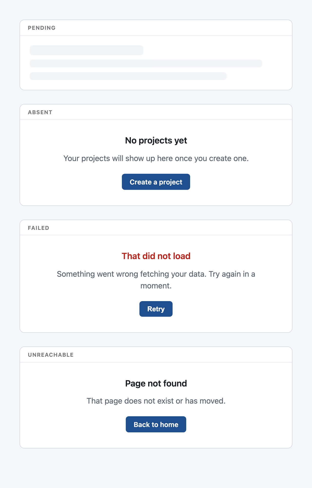

# GRACE

<picture>
  <source media="(prefers-color-scheme: dark)" srcset="assets/grace-render-dark.png">
  
</picture>

GRACE is state components for the off-happy-path: the moment before data arrives, the case where there is none, the failure, and the dead route. AI-built surfaces ship the happy path and skip these, so a list shows a blank instead of "nothing yet," a fetch shows a bare spinner, and a failed request white-screens. GRACE renders the four states honestly, accessible by default, themed by TEMPER. It is the reusable form of [LUCID](https://github.com/Polymathie-Studio/lucid)'s off-happy-path principle.

No build step is required to use it: the framework-agnostic core is one small ES module and one CSS file, with a React binding alongside. The package name is `grace-states`; it is planned for npm but not yet published.

## The four states

- **Skeleton** (pending): a content-shaped placeholder, not a bare spinner, so the layout does not jump when the real content lands.
- **Empty** (absent): why it is empty and the one next step, not a blank and not "no data."
- **Error** (failed): plain language and a way back, never a raw code or a silent swallow.
- **NotFound** (unreachable): says it is not here and points somewhere real, for a 404 or a dead route.

## Contents

- `grace.css`: the skeleton and the shared state layout, written against TEMPER's tokens with a fallback for each.
- `grace.js`: the zero-dependency core. Registers `<grace-empty>`, `<grace-error>`, and `<grace-notfound>`; the pending state is the `.grace-skeleton` class.
- `react/index.js`: the React binding, `Skeleton`, `Empty`, `ErrorState`, and `NotFound`.
- `demo.html`: a self-contained preview of all four states.

## Quickstart

### Any site, no framework

Copy `grace.css` and `grace.js` into your project. Apply the skeleton class to placeholders and use the elements for the rest.

```html
<link rel="stylesheet" href="/grace.css">
<script type="module" src="/grace.js"></script>

<!-- pending: shape the skeleton like what will arrive -->
<div class="grace-skeleton" style="height: 1.5rem; width: 60%"></div>

<!-- absent -->
<grace-empty
  heading="No projects yet"
  message="Your projects will show up here once you create one."
  action="Create a project" href="/new"></grace-empty>

<!-- failed: an action with no href dispatches grace-action, which is your retry -->
<grace-error
  heading="That did not load"
  message="Something went wrong fetching your data. Try again in a moment."
  action="Retry"></grace-error>
```

### React

```tsx
import 'grace-states/grace.css'
import { Skeleton, Empty, ErrorState, NotFound } from 'grace-states/react'

function Projects({ loading, error, items, onRetry }) {
  if (loading) return <Skeleton style={{ height: '1.5rem', width: '60%' }} />
  if (error) return <ErrorState heading="That did not load" message="Try again in a moment." action="Retry" onAction={onRetry} />
  if (!items.length) return <Empty heading="No projects yet" message="They will show up here." action="Create a project" href="/new" />
  return items.map(renderProject)
}
```

## Accessibility

The error state uses an assertive live region so a screen reader announces it; empty and not-found use a polite one. Every action is a real button or link, keyboard-operable with a visible focus ring. The skeleton pulse runs only under `prefers-reduced-motion: no-preference`, and the placeholder carries no text for assistive tech to read.

## Composing with TEMPER

GRACE reads TEMPER's semantic tokens (surface, border, text, accent, danger, plus the spacing and type scales) with a fallback for each. Set a TEMPER mode on the root and GRACE follows it; where TEMPER is absent, the fallbacks render a clean neutral state.

## Part of the Polymathie family

GRACE is one of the [Polymathie](https://github.com/Polymathie-Studio) primitives: small, dependency-free pieces for building websites, dashboards, and tools, where each protects one posture that fast, AI-assisted building tends to drop. Its siblings are [TEMPER](https://github.com/Polymathie-Studio/temper) (legibility and design tokens), [LUCID](https://github.com/Polymathie-Studio/lucid) (honest disclosure), and [HASP](https://github.com/Polymathie-Studio/hasp) (bring-your-own-key privacy), with more of the invisible-correctness layer in progress. Adopt one and the others compose with it.

## License

Apache-2.0. Copyright 2026 Regis Lloyd Chapman. See `LICENSE` and `NOTICE`.
