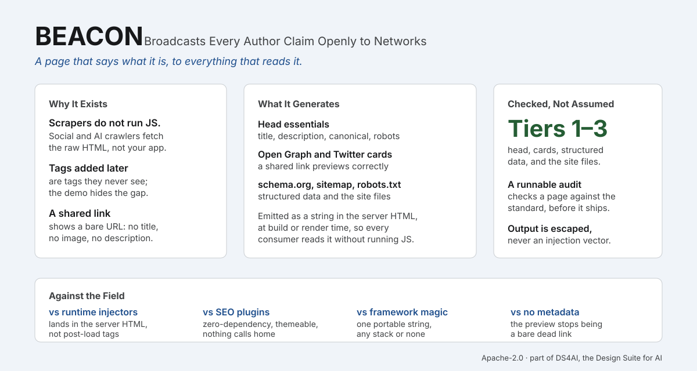

# BEACON

<picture>
  <source media="(prefers-color-scheme: dark)" srcset="assets/beacon-overview-dark.svg">
  
</picture>

BEACON is findability: the metadata a shipped page must carry so it represents itself correctly to search engines, social shares, and machines. A page with no title tag, no canonical, and no Open Graph tags renders fine for a person and is nearly invisible to everything else. When a link to it is shared, the preview is a bare URL with no title and no image; when a crawler or an AI agent reads it, there is nothing to read. BEACON gives you that metadata, correct and complete, themed to your content.

It covers its findability set across Tiers 1 to 3: Tier 1, the head essentials (title, description, canonical, robots, viewport, charset) plus Open Graph and Twitter cards; Tier 2, schema.org structured data, the sitemap and robots.txt serializers, and favicon and manifest; and Tier 3, a findability auditor and an llms.txt serializer. It stays **0.x** until a numbered release is cut.

## Why it generates a string, not runtime tags

BEACON breaks the shape of its sibling primitives on purpose. The single most damaging findability failure in fast, client-rendered builds is metadata injected by JavaScript after the page loads: the social and AI scrapers that matter most (`facebookexternalhit`, `Twitterbot`, `LinkedInBot`, Slack) do not run JavaScript, so they fetch the raw HTML and see none of it. A runtime tag injector reproduces the exact failure it should prevent. So BEACON produces its output at build or server-render time, as a string of tags that lands in the server-returned HTML, where every consumer can read it.

## Quickstart

### Any site, no framework

Call `head()` with a plain metadata object and place the result inside your `<head>` when you render the page on the server or at build time.

```js
import { head, htmlAttrs } from 'beacon-ui'

const tags = head({
  title: 'Pricing that scales with you',
  description: 'Simple per-seat pricing, no hidden tiers.',
  canonical: 'https://example.com/pricing',
  siteName: 'Example',
  image: 'https://example.com/og/pricing.png',
  imageAlt: 'The Example pricing table',
  locale: 'en_US',
  twitterSite: '@example',
})

// tags is a string of <meta>, <title>, and <link> elements. Insert it in <head>:
// `<html ${htmlAttrs({ lang: 'en' })}><head>${tags}</head> ...`
```

### React

`Head` renders the same tags as elements. React 19 hoists `title`, `meta`, and `link` to `<head>` from wherever they render, so you can put it in a page or layout.

```tsx
import { Head } from 'beacon-ui/react'

export default function PricingPage() {
  return (
    <>
      <Head
        title="Pricing that scales with you"
        description="Simple per-seat pricing, no hidden tiers."
        canonical="https://example.com/pricing"
        siteName="Example"
        image="https://example.com/og/pricing.png"
      />
      <main>...</main>
    </>
  )
}
```

On React 18, which does not hoist, place `Head` where head content belongs or use a head manager.

## What it generates

From one flat object, `head()` emits, in order: a UTF-8 charset (first, so every text field below is decoded correctly), a viewport, the `<title>`, the meta description, the canonical link, an optional robots directive, the Open Graph tags (`og:title`, `og:type`, `og:url`, `og:description`, `og:site_name`, `og:locale`, and the image with its sub-properties), and the Twitter card (which falls back to the Open Graph tags, so only the card type is required). Every value is HTML-escaped.

## Structured data and site files

The schema.org builders return plain objects; `jsonLd` serializes one or several (combined under `@graph`) into a script tag, with the `</script>` sequence escaped so it cannot break out. The site files are pure serializers you write at build time.

```js
import { jsonLd, organization, website, article, breadcrumb, sitemap, robots, icons, manifest } from 'beacon-ui'

// JSON-LD in <head>: compose builders, serialize once.
const ld = jsonLd([
  organization({ name: 'Example', url: 'https://example.com', logo: 'https://example.com/logo.png', sameAs: ['https://x.com/example'] }),
  website({ name: 'Example', url: 'https://example.com' }),
])

// Root files, written at build time:
sitemap([{ loc: 'https://example.com/', lastmod: '2026-08-19' }, 'https://example.com/pricing'])
robots({ sitemap: 'https://example.com/sitemap.xml', disallow: '/admin' })
manifest({ name: 'Example', shortName: 'Ex', themeColor: '#1e4e8c', icons: [{ src: '/icon-192.png', sizes: '192x192', type: 'image/png' }] })
icons({ svg: '/icon.svg', appleTouchIcon: '/apple-touch-icon.png', manifest: '/site.webmanifest' })
```

In React, `JsonLd` and `Icons` render the head-going pieces, and the schema builders are re-exported from `beacon-ui/react`:

```tsx
import { JsonLd, Icons, article } from 'beacon-ui/react'

<JsonLd schema={article({ title: 'A post', author: 'Regis', datePublished: '2026-08-19' })} />
<Icons svg="/icon.svg" appleTouchIcon="/apple-touch-icon.png" manifest="/site.webmanifest" />
```

The sitemap, robots.txt, and manifest are build-time files, so they have no React component; call the serializers and write their output.

## Auditing a page

`audit(html)` scans a page's HTML and returns `{ ok, errors, warnings, passed }`, each a list of `{ level, code, message }`. It checks the head essentials, Open Graph and Twitter, JSON-LD validity, and the canonical-versus-`og:url` agreement invariant. To test the render gate, audit the raw server response (fetched without JavaScript), since the tags must be there for the non-JS scrapers; BEACON does not fetch, so you pass it the HTML.

```js
import { audit, llmstxt } from 'beacon-ui'

const report = audit(serverHtmlString)
if (!report.ok) console.error(report.errors)

// llms.txt, an emerging convention (not consumed by the major engines):
llmstxt({
  name: 'Example',
  summary: 'What Example does, in one line.',
  sections: [{ title: 'Docs', links: [{ title: 'Getting started', url: 'https://example.com/start' }] }],
})
```

This is a lightweight scan of the served markup, not a full validator; pair it with Google's Rich Results Test for schema eligibility.

## Two invariants it helps you hold

- **Agreement.** The canonical URL, `og:url`, and (later) the sitemap entry for a page should name the same absolute URL. BEACON defaults `og:url` to your canonical so they cannot drift.
- **Separation.** Keeping a page out of the index is the `robots` directive's job (`noindex`), not robots.txt. BEACON puts index control where it belongs, in the head.

## Part of DS4AI, the Design Suite for AI

BEACON is one instrument in **DS4AI, the Design Suite for AI, from [Polymathie-Studio](https://github.com/Polymathie-Studio)**: small, dependency-free pieces that each close one axis of the *invisible-correctness layer*, the part of a shipped surface a look-at-it review cannot see and that fast, AI-assisted building drops.

- **[TEMPER](https://github.com/Polymathie-Studio/temper)**: perceivable, color and design tokens
- **[GRASP](https://github.com/Polymathie-Studio/grasp)**: operable, interaction components
- **[LUCID](https://github.com/Polymathie-Studio/lucid)** + **[GRACE](https://github.com/Polymathie-Studio/grace)**: honest off the happy path, disclosure and state components
- **[HASP](https://github.com/Polymathie-Studio/hasp)**: hardened, client-surface security posture
- **[BEACON](https://github.com/Polymathie-Studio/beacon)**: findable, head metadata and site files
- **[FLEET](https://github.com/Polymathie-Studio/fleet)**: fast and stable, delivery

**[MISSING](https://github.com/Polymathie-Studio/missing)** is the standard at the center of DS4AI: it names the axes, routes each to its instrument, and ships a machine-readable manifest and a conformance auditor. Adopt one and the others compose with it.

## License

Apache-2.0. Copyright 2026 Regis Lloyd Chapman. See `LICENSE` and `NOTICE`.
